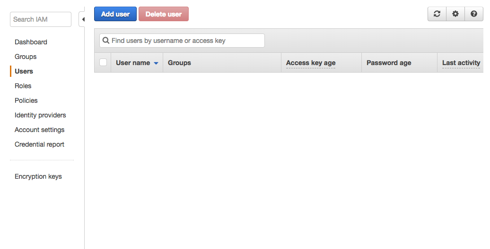
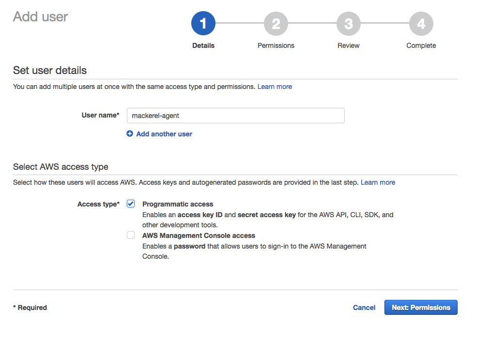
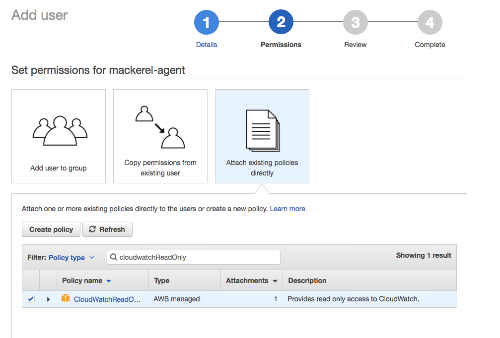
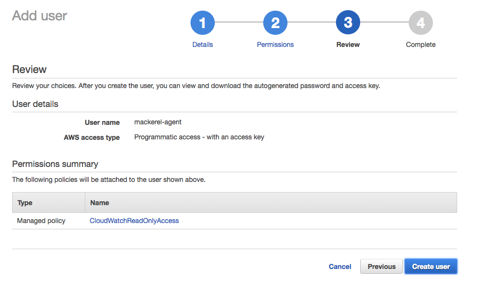
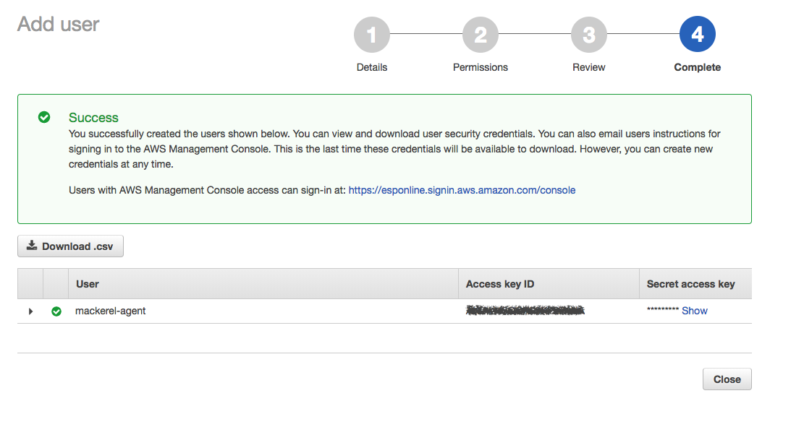

# Monitor AWS services with Mackerel

# Introduction
Mackerel is a server monitoring service that also supports AWS cloud products. Using the CloudWatch (an AWS monitoring service) API, various AWS cloud products (such as ELB, RDS, and ElastiCache) can be monitored with Mackerel. The only required configurations for Mackerel are registering the read-only access key and making a simple selection.
In this post I'll show how to configure mackerel to monitor ELB and RDS.

# IAM User Creation

We need an AWS IAM user with the following policy.

- CloudWatchReadOnlyAccess

You can create the user from `AWS Console` or `AWS CLI`. 

## From AWS Console

- Login to the AWS IAM console and go to the Users section.
    
- Select `Add user`.
    
- Fill out the form.
  - Input an username for Mackerel-agent. e.g- `mackerel-agent`.
  - Select AWS access type- `Programmatic access`.
- Select `Next: Permissions` to go to the next page.
    
- Attach the policies for the user
  - Select `Attach existing policies directly` underneath `Set permissions for YOUR-USERNAME`
  - Search for `CloudWatchReadOnly` on the filter section.
  - Check `CloudWatchReadOnlyAccess`
- Select `Next: Review` to go to the next page.
    
- Select `Create user`
- You'll get a success message.
    
- Select `Download .csv` to downlod the user credentials and don't lose it. Alternatively, you can copy the `Access key ID` and `Secret access key` which we'll use in next.
  

## From AWS CLI

```
$ USER=mackerel-agent
# Create IAM User
$ aws iam create-user --user-name $USER
{
    "User": {
        "UserName": "mackerel-agent",
        "Path": "/",
        "CreateDate": "2018-01-15T10:04:13.381Z",
        "UserId": "XXXXXXXXXXXXXXXXXXXXX",
        "Arn": "arn:aws:iam::999999999999:user/mackerel-agent"
    }
}
# Attach Access Policy
$ aws iam attach-user-policy --user-name $USER --policy-arn arn:aws:iam::aws:policy/CloudWatchReadOnlyAccess
# Generate AccessKey
$ aws iam create-access-key --user-name $USER
{
    "AccessKey": {
        "UserName": "mackerel-agent",
        "Status": "Active",
        "CreateDate": "2018-01-15T10:06:33.644Z",
        "SecretAccessKey": "YYYYYYYYYYYYYYYYYYYYYYYYYYYY/zzzzzzzzzzz",
        "AccessKeyId": "WWWWWWWWWWWWWWWWWWWW"
    }
}
```


# Mackerel Installation

- Create account and sign in to [https://mackerel.io/](https://mackerel.io/)
- Follow the [instructions](https://mackerel.io/instructions) after login.
- You can check this document to install mackerel-agent. (https://mackerel.io/docs/entry/howto/install-agent)

# Mackerel plugins configuration

I'm writing the commands as Amazon Linux. The commands may be different based on operating system.

- Install mackerel-plugins with the following command.

    ```
    sudo yum install mackerel-plugins
    ```

## Uptime

- Open config file and enable plugin
  
    ```
    sudo vi /etc/mackerel-agent/mackerel-agent.conf    
    ```
    
- Add the following code to the end of the file
    
    ```
    # /etc/mackerel-agent/mackerel-agent.conf
    [plugin.checks.uptime]
    command = "/usr/bin/mackerel-plugin-uptime"
    ```
    
- Restart mackerel
    
    ```
    sudo service mackerel-agent restart
    ```    
    
## MySQL

- Open config file and enable plugin
  
    ```
    sudo vi /etc/mackerel-agent/mackerel-agent.conf    
    ```
    
- Add the following code to the end of the file
    
    ```
    # /etc/mackerel-agent/mackerel-agent.conf
    [plugin.metrics.mysql]
    command = "/usr/bin/mackerel-plugin-mysql -host=127.0.0.1 -port=3306 -username=root -password=PASSWORD"
    ```
    
- Restart mackerel
    
    ```
    sudo service mackerel-agent restart
    ```    
    
## Apache

### Apache configuration
Apache's `mod_status` is required.

- Check the config file.

    ```
    sudo vi /etc/httpd/httpd.conf
    ```

    - If it's already installed the following description should be in config files.
    
        ```
        # /etc/httpd/httpd.conf
        LoadModule status_module modules/mod_status.so
        ```
    
    - If it's not, lets add it.
    
        ```$xslt
        /etc/httpd/httpd.conf
        ExtendedStatus On
        <VirtualHost 127.0.0.1:1080>
            <Location /server-status>
                SetHandler server-status
                Order deny,allow
                Deny from all
                Allow from localhost
            </Location>
        </VirtualHost>
        ```
        
- Save and test config.

    ```
    sudo service httpd configtest
    ```
- Restart apache if test is successful.
    
    ```
    sudo service httpd restart
    ```
    
### Mackerel Configration

- Open config file and enable plugin
  
    ```
    sudo vi /etc/mackerel-agent/mackerel-agent.conf    
    ```
    
- Add the following code to the end of the file
    
    ```
    # /etc/mackerel-agent/mackerel-agent.conf
    [plugin.metrics.apache2]
    command = "/usr/bin/mackerel-plugin-apache2 -p 1080"
    type = "metric"
    ```
        
- Restart mackerel
    
    ```
    sudo service mackerel-agent restart
    ```    

## Nginx

### Nginx configuration

Confirm that `stub_status` can be used in Nginx.

- Open the config file.

    ```
    sudo vi /etc/nginx/conf.d/default.conf
    ```

- Add the following code into the config file

    ```
    # /etc/nginx/conf.d/default.conf
    server {
        listen 8080;
        server_name localhost;
        location /nginx_status {
            stub_status on;
            access_log off;
            allow 127.0.0.1;
            deny all;
        }
    }
    ```
    
- Save and test config.

    ```
    sudo nginx -t
    ```
- Reload nginx if test is successful.
    
    ```
    sudo nginx -s reload
    ```
    
- Confirm that the Nginx's `stub_status` is working.

    ```
    curl http://localhost:8080/nginx_status
    ```
    
- It it's successful, the result will appear as follows-
    
    ```
    Active connections: 6 
    server accepts handled requests
     3508 3508 6026 
    Reading: 0 Writing: 2 Waiting: 4
    ```


### Mackerel Configration

- Open config file and enable plugin
  
    ```
    sudo vi /etc/mackerel-agent/mackerel-agent.conf    
    ```
    
- Add the following code to the file
    
    ```
    # /etc/mackerel-agent/mackerel-agent.conf
    [plugin.metrics.nginx]
    command = "/usr/bin/mackerel-plugin-nginx"
    ```
        
- Restart mackerel
    
    ```
    sudo service mackerel-agent restart
    ```    
    
## PHP-FPM

### PHP-FPM Configuration

- Open php-fpm config file
    ```
    sudo vi /etc/php-fpm.d/www.conf
    ```
    
- Uncomment the following line.

    ```
    # /etc/php-fpm.d/www.conf
    pm.status_path = /status
    ```
    
- Save and test config.

    ```
    sudo service php-fpm configtest
    ```
- Restart php-fpm if test is successful.
    
    ```
    sudo service php-fpm restart
    ```
        
### Nginx configuration

- Open the config file.

    ```
    sudo vi /etc/nginx/conf.d/default.conf
    ```

- Add the following code into the config file

    ```
    # /etc/nginx/conf.d/default.conf
    server {
        listen 8080;
        server_name localhost;
        location /nginx_status {
            stub_status on;
            access_log off;
            allow 127.0.0.1;
            deny all;
        }
    
        location /status {
            fastcgi_pass 127.0.0.1:9000;
            fastcgi_index index.php;
            fastcgi_param SCRIPT_FILENAME $document_root$fastcgi_script_name;
            include fastcgi_params;
            fastcgi_buffers 256 128k;
            fastcgi_buffer_size 128k;
            fastcgi_intercept_errors on;
            fastcgi_read_timeout 120s;
            access_log off;
            allow 127.0.0.1;
            deny all;
        }
    }
    
    # Use fastcgi_pass unix_socket=/var/run/php-fpm/www.sock, if you're using php socket.

    ```
    
- Save and test config.

    ```
    sudo nginx -t
    ```
- Reload nginx if test is successful.
    
    ```
    sudo nginx -s reload
    ```
    
- Confirm that the Nginx's `/status` is working.

    ```
    curl http://localhost:8080/status?json
    ```
    
- It it's successful, the result will appear as follows-
    
    ```
    {"pool":"www","process manager":"dynamic","start time":1515838009,"start since":145679,"accepted conn":62,"listen queue":0,"max listen queue":0,"listen queue len":0,"idle processes":5,"active processes":1,"total processes":6,"max active processes":1,"max children reached":0,"slow requests":0}
    ```

### Apache configuration
Apache's `mod_status` is required.

- Open the config file.

    ```
    sudo vi /etc/httpd/httpd.conf
    ```

- Add the following code.

    ```
    ExtendedStatus On
    <VirtualHost 127.0.0.1:1080>
        <Location /server-status>
            SetHandler server-status
            Order deny,allow
            Deny from all
            Allow from localhost
        </Location>
      <Location /status>
        SetHandler "proxy:unix:/var/run/php-fpm/www.sock|fcgi://localhost/"
        Order deny,allow
        Deny from all
        Allow from localhost
      </Location>
    </VirtualHost>
    ```
    
        
- Save and test config.

    ```
    sudo service httpd configtest
    ```
- Restart apache if test is successful.
    
    ```
    sudo service httpd restart
    ```
    
### Mackerel Configration

- Open config file and enable plugin
  
    ```
    sudo vi /etc/mackerel-agent/mackerel-agent.conf    
    ```
    
- Add the following code between `Plgugin for PHP APC` and `Plugin for Plack`.
    
    ```
    # /etc/mackerel-agent/mackerel-agent.conf
    [plugin.metrics.php-fpm]
    command = "/usr/bin/mackerel-plugin-php-fpm -url http://localhost:8080/status?json"
    ```
        
- Restart mackerel
    
    ```
    sudo service mackerel-agent restart
    ```    
       
## RDS

- Open config file and enable plugin
  
    ```
    sudo vi /etc/mackerel-agent/mackerel-agent.conf    
    ```
    
- Add the following code on the config file.
    
    ```
    # /etc/mackerel-agent/mackerel-agent.conf
    # mackerel-plugin-aws-rds -identifier=<db-instance-identifer> [-region=<aws-region>] [-access-key-id=<id>] [-secret-access-key=<key>] [-tempfile=<tempfile>] [-metric-key-prefix=<prefix>] [-metric-label-prefix=<label-prefix>]
    [plugin.metrics.aws-rds]
    command = "/usr/local/bin/mackerel-plugin-aws-rds -identifier=DBIDENTIFIER -region=REGION -access-key-id=AWS_ACCESS_KEY_ID -secret-access-key=AWS_SECRET_ACCESS_KEY"
    ```
        
- Restart mackerel
    
    ```
    sudo service mackerel-agent restart
    ```      

## ELB

- Open config file and enable plugin
  
    ```
    sudo vi /etc/mackerel-agent/mackerel-agent.conf    
    ```
    
- Add the following code on the config file.
    
    ```
    # /etc/mackerel-agent/mackerel-agent.conf
    # mackerel-plugin-aws-elb [-lbname=<aws-load-blancer-name>] [-region=<aws-region>] [-access-key-id=<id>] [-secret-access-key=<key>] [-tempfile=<tempfile>]
    [plugin.metrics.aws-elb]
    command = "/usr/local/bin/mackerel-plugin-aws-elb -lbname=ELB_NAME -region=REGION -access-key-id=AWS_ACCESS_KEY_ID -secret-access-key=AWS_SECRET_ACCESS_KEY"
    ```
        
- Restart mackerel
    
    ```
    sudo service mackerel-agent restart
    ```    
       
